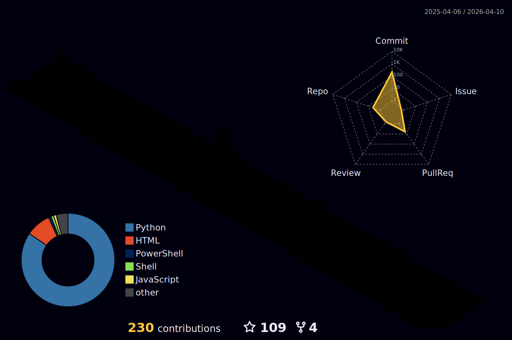

  

 

        
        
        
  

  

 

<h2>👩‍💻  About Me</h2>
I love code   and unicorns  
    
        

  

# 💻 Tech Stack:
                                  

<h2>📊 GitHub Stats:</h2>
<table>
<tr>
<td></td>
<td></td>
<td></td>
</tr>
</table>

  
  

	

  <table>
    <tr>
      <td>
        

          <!-- Rotated Image -->
          
        

      </td>
      <td>
        

          <!-- Right SVG -->
          
        

      </td>
    </tr>
  </table>

